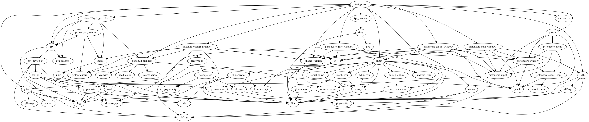

# start_piston
A high level experiment with [Piston](https://github.com/pistondevelopers/piston) and [Gfx](https://github.com/gfx-rs/gfx-rs)

### Features

- `include_glfw`
- `include_glutin`
- `include_sdl2`
- `include_gfx_glfw`
- `include_gfx_glutin`
- `include_gfx_sdl2`

### Example

```
[dependencies.start_piston]
git = "https://github.com/bvssvni/start_piston"
features = ["include_gfx_glutin"]
```

### Dependency graph


